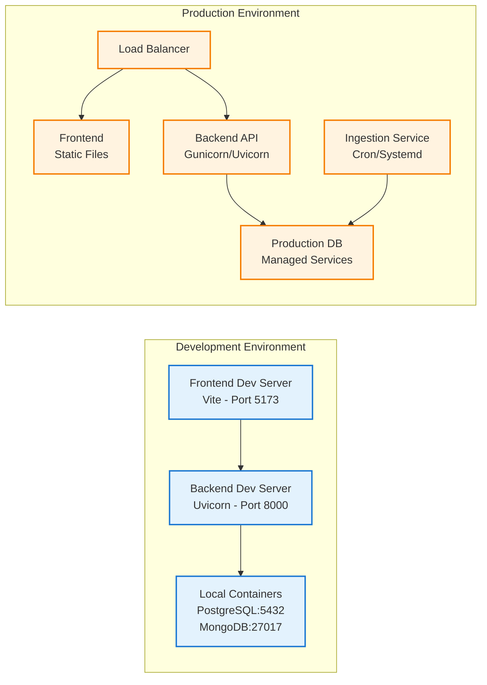

# Air Quality Platform - Architecture Diagram

## System Architecture Overview

```mermaid
graph TB
    subgraph "External Data Sources"
        AQICN[AQICN API<br/>Real-time Air Quality]
        CSV[Historical CSV Files<br/>Air Quality Data]
        GeoJSON[GeoJSON Files<br/>Station Metadata]
    end

    subgraph "Ingestion Service"
        CLI[CLI Entry Point<br/>main.py / __main__.py]
        IngestionService[Ingestion Service<br/>Orchestration Layer]
        
        subgraph "Adapters (Strategy Pattern)"
            BaseAdapter[Base Adapter Interface]
            CSVAdapter[Historical CSV Adapter]
            AQICNAdapter[AQICN API Adapter]
        end
        
        subgraph "Domain Layer"
            DTOs[Data Transfer Objects<br/>Pydantic Models]
            Normalization[Data Normalization<br/>Validation Logic]
        end
        
        CLI --> IngestionService
        IngestionService --> BaseAdapter
        BaseAdapter --> CSVAdapter
        BaseAdapter --> AQICNAdapter
        CSVAdapter --> DTOs
        AQICNAdapter --> DTOs
        DTOs --> Normalization
    end

    subgraph "Database Layer"
        subgraph "PostgreSQL + PostGIS"
            PG_Station[(Station Table<br/>Geospatial Data)]
            PG_Pollutant[(Pollutant Table<br/>Reference Data)]
            PG_Reading[(Air Quality Reading<br/>Time Series Data)]
            PG_User[(User Table)]
            PG_Role[(Role Table)]
        end
        
        subgraph "MongoDB"
            Mongo_Config[(Dashboard Config)]
            Mongo_Reports[(User Reports)]
            Mongo_Preferences[(User Preferences)]
        end
    end

    subgraph "Backend API (FastAPI)"
        MainAPI[main.py<br/>FastAPI Application]
        
        subgraph "API Layer"
            AuthAPI[Auth Endpoints<br/>/api/v1/auth]
            StationAPI[Station Endpoints<br/>/api/v1/stations]
            ReadingAPI[Reading Endpoints<br/>/api/v1/readings]
            DashboardAPI[Dashboard Endpoints<br/>/api/v1/dashboards]
            ReportAPI[Report Endpoints<br/>/api/v1/reports]
        end
        
        subgraph "Service Layer"
            AuthService[Authentication Service<br/>JWT & Security]
            DashboardService[Dashboard Service<br/>Builder Pattern]
            RecommendationService[Recommendation Service<br/>Factory Pattern]
            RiskService[Risk Category Service<br/>Strategy Pattern]
            ReportService[Report Service]
        end
        
        subgraph "Repository Layer"
            StationRepo[Station Repository]
            ReadingRepo[Reading Repository]
            UserRepo[User Repository]
            ConfigRepo[Config Repository]
        end
        
        subgraph "Core Layer"
            Config[Configuration<br/>Environment Variables]
            Security[Security & JWT]
            Logging[Logging Config]
        end
        
        MainAPI --> AuthAPI
        MainAPI --> StationAPI
        MainAPI --> ReadingAPI
        MainAPI --> DashboardAPI
        MainAPI --> ReportAPI
        
        AuthAPI --> AuthService
        StationAPI --> StationRepo
        ReadingAPI --> ReadingRepo
        DashboardAPI --> DashboardService
        ReportAPI --> ReportService
        
        DashboardService --> RecommendationService
        DashboardService --> RiskService
        
        AuthService --> Security
        StationRepo --> Config
        ReadingRepo --> Logging
    end

    subgraph "Frontend (Vue 3 + TypeScript)"
        VueApp[Vue Application<br/>main.ts]
        
        subgraph "Router"
            Routes[Vue Router<br/>Route Configuration]
        end
        
        subgraph "Views"
            Landing[Landing Page]
            Login[Login View]
            CitizenDash[Citizen Dashboard]
            ResearchDash[Researcher Dashboard]
            AdminDash[Admin Dashboard]
            Settings[Settings View]
        end
        
        subgraph "Components"
            MapComponent[Map Component<br/>Leaflet/MapBox]
            ChartComponent[Chart Component<br/>Data Visualization]
            StationCard[Station Card]
            FilterComponent[Filter Component]
        end
        
        subgraph "Services"
            HTTPClient[HTTP Client<br/>Axios/Fetch]
            AuthClient[Auth Service]
            APIServices[API Services<br/>Station/Reading/Report]
        end
        
        VueApp --> Routes
        Routes --> Landing
        Routes --> Login
        Routes --> CitizenDash
        Routes --> ResearchDash
        Routes --> AdminDash
        Routes --> Settings
        
        CitizenDash --> MapComponent
        CitizenDash --> ChartComponent
        ResearchDash --> StationCard
        AdminDash --> FilterComponent
        
        MapComponent --> HTTPClient
        ChartComponent --> APIServices
        StationCard --> APIServices
        AuthClient --> HTTPClient
        APIServices --> HTTPClient
    end

    subgraph "Container Infrastructure"
        DockerCompose[Docker Compose<br/>Orchestration]
        PGContainer[PostgreSQL Container<br/>Port 5432]
        MongoContainer[MongoDB Container<br/>Port 27017]
        
        DockerCompose --> PGContainer
        DockerCompose --> MongoContainer
    end

    %% Data Flow Connections
    CSV --> CSVAdapter
    GeoJSON --> CSVAdapter
    AQICN --> AQICNAdapter
    
    Normalization --> PG_Station
    Normalization --> PG_Reading
    
    StationRepo --> PG_Station
    StationRepo --> PG_Pollutant
    ReadingRepo --> PG_Reading
    UserRepo --> PG_User
    UserRepo --> PG_Role
    ConfigRepo --> Mongo_Config
    ReportService --> Mongo_Reports
    
    PGContainer --> PG_Station
    PGContainer --> PG_Pollutant
    PGContainer --> PG_Reading
    PGContainer --> PG_User
    PGContainer --> PG_Role
    
    MongoContainer --> Mongo_Config
    MongoContainer --> Mongo_Reports
    MongoContainer --> Mongo_Preferences
    
    HTTPClient --> MainAPI
    
    %% Styling
    classDef external fill:#e1f5ff,stroke:#01579b,stroke-width:2px
    classDef ingestion fill:#fff3e0,stroke:#e65100,stroke-width:2px
    classDef database fill:#f3e5f5,stroke:#4a148c,stroke-width:2px
    classDef backend fill:#e8f5e9,stroke:#1b5e20,stroke-width:2px
    classDef frontend fill:#fce4ec,stroke:#880e4f,stroke-width:2px
    classDef container fill:#fff9c4,stroke:#f57f17,stroke-width:2px
    
    class AQICN,CSV,GeoJSON external
    class CLI,IngestionService,BaseAdapter,CSVAdapter,AQICNAdapter,DTOs,Normalization ingestion
    class PG_Station,PG_Pollutant,PG_Reading,PG_User,PG_Role,Mongo_Config,Mongo_Reports,Mongo_Preferences database
    class MainAPI,AuthAPI,StationAPI,ReadingAPI,DashboardAPI,ReportAPI,AuthService,DashboardService,RecommendationService,RiskService,ReportService,StationRepo,ReadingRepo,UserRepo,ConfigRepo,Config,Security,Logging backend
    class VueApp,Routes,Landing,Login,CitizenDash,ResearchDash,AdminDash,Settings,MapComponent,ChartComponent,StationCard,FilterComponent,HTTPClient,AuthClient,APIServices frontend
    class DockerCompose,PGContainer,MongoContainer container
```

## Component Descriptions

### External Data Sources
- **AQICN API**: Real-time air quality data from World Air Quality Index
- **Historical CSV Files**: Past air quality readings from various stations
- **GeoJSON Files**: Geospatial metadata for monitoring stations

### Ingestion Service
- **CLI Entry Point**: Command-line interface for running ingestion jobs
- **Ingestion Service**: Orchestrates data ingestion from multiple sources
- **Adapters**: Implement Strategy Pattern to handle different data sources
  - CSV Adapter: Processes historical CSV files
  - AQICN Adapter: Fetches real-time data from AQICN API
- **Domain Layer**: Contains DTOs and normalization logic for data validation

### Database Layer
- **PostgreSQL + PostGIS**: Relational database with geospatial extensions
  - Stores stations, pollutants, readings, users, and roles
  - Time-series data for air quality measurements
- **MongoDB**: NoSQL database for flexible configuration storage
  - Dashboard configurations
  - User reports and preferences

### Backend API (FastAPI)
- **API Endpoints**: RESTful endpoints for frontend consumption
- **Service Layer**: Business logic with design patterns
  - Builder Pattern (Dashboard construction)
  - Factory Pattern (Recommendation generation)
  - Strategy Pattern (Risk categorization)
- **Repository Layer**: Data access abstraction using Repository Pattern
- **Core Layer**: Cross-cutting concerns (config, security, logging)

### Frontend (Vue 3 + TypeScript)
- **Vue Application**: Single Page Application with TypeScript
- **Views**: Role-based dashboards (Citizen, Researcher, Admin)
- **Components**: Reusable UI elements (maps, charts, cards)
- **Services**: API communication layer with HTTP client

### Container Infrastructure
- **Docker Compose**: Orchestrates PostgreSQL and MongoDB containers
- **Containers**: Isolated database instances with persistent volumes

## Design Patterns Implemented

1. **Adapter Pattern** (Ingestion): Unifies different data sources
2. **Strategy Pattern** (Backend): Risk categorization based on AQI levels
3. **Builder Pattern** (Backend): Complex dashboard response construction
4. **Factory Pattern** (Backend): Recommendation generation
5. **Repository Pattern** (Backend): Data access abstraction
6. **Prototype Pattern** (Backend): Dashboard configuration cloning

## Data Flow

### Ingestion Flow
1. External sources → Adapters → DTOs → Normalization → Database

### API Request Flow
1. Frontend HTTP Client → Backend API Endpoints → Services → Repositories → Database
2. Database → Repositories → Services → API Response → Frontend

### Authentication Flow
1. Frontend Login → Auth API → Auth Service → JWT Generation → Frontend Storage
2. Subsequent requests include JWT → Backend validates → Access granted/denied

## Technology Stack

- **Frontend**: Vue 3, TypeScript, Vite
- **Backend**: Python, FastAPI, SQLAlchemy, Pydantic
- **Databases**: PostgreSQL 14 + PostGIS, MongoDB 7.0
- **Containerization**: Docker, Docker Compose
- **APIs**: AQICN API for real-time data
- **Authentication**: JWT (JSON Web Tokens)

## Deployment Architecture

## Monitoring and Observability

- **Logging**: Structured logging across all services
- **Health Checks**: Database connection monitoring
- **Error Handling**: Comprehensive exception handling with proper HTTP status codes
- **Validation**: Input validation using Pydantic schemas

## Security Considerations

- **Authentication**: JWT-based authentication
- **Authorization**: Role-based access control (Citizen, Researcher, Admin)
- **Database Security**: Separate users with minimal required permissions
- **Environment Variables**: Sensitive data stored in .env files (not committed)
- **Input Validation**: Pydantic models validate all incoming data
- **CORS**: Configured for frontend-backend communication

---

**Last Updated**: December 2025  
**Version**: 1.0.0
